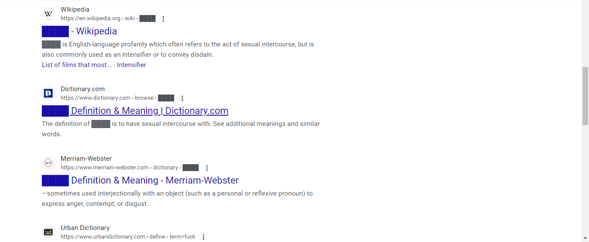
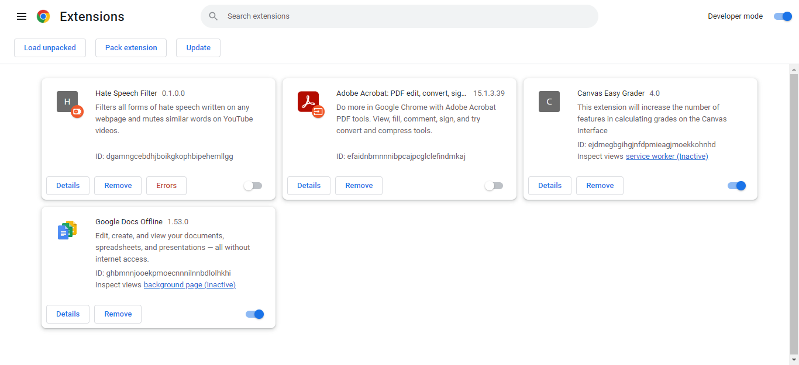

# Hate Speech Filter
A Google Chrome extension that censors blacklisted words from websites and mutes YouTube videos when they are uttered 

This is an example of the extension working in Chrome:

You can turn it on through Google extensions by packaging this repo:

